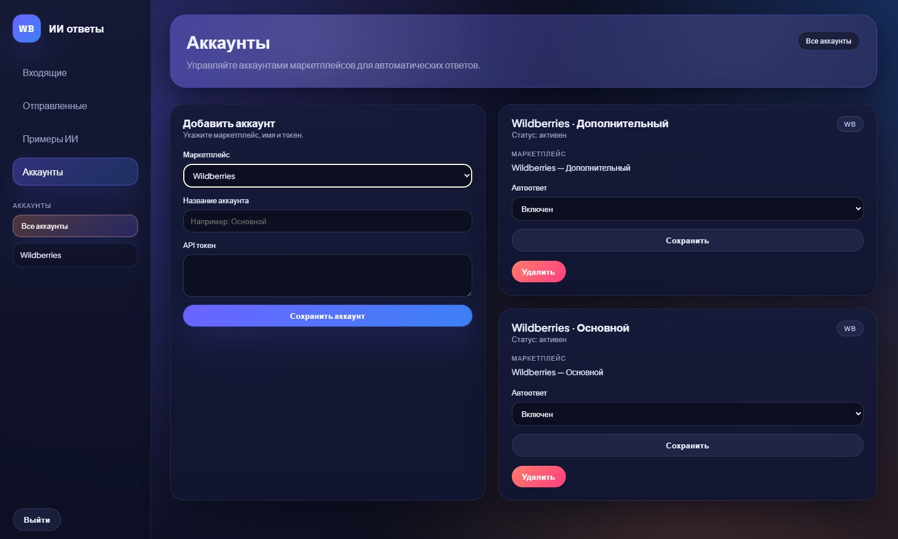

# WB Reviews Auto-Reply Service

[English version](#english)

Сервис для автоматизации обработки отзывов/вопросов на Wildberries: фоновый воркер регулярно опрашивает WB API, сохраняет новые события в SQLite и генерирует ответы через OpenAI. Для рейтинга 4–5 доступна автоотправка, для низких оценок — ручное подтверждение. Настройки и промпт редактируются из админки без правок кода.

**Стек**
- Python 3.11+
- SQLite
- OpenAI API
- Wildberries API
- Flask (админка)

**Запуск**
```powershell
python -m venv venv
venv\Scripts\activate
pip install -r requirements.txt
copy .env.example .env
# заполните OPENAI_API_KEY и WB_API_TOKEN (или WB_ACCOUNTS) в .env
python main.py
```

**Админка**
```powershell
python admin.py
```
После запуска откройте `http://127.0.0.1:8000/setup` для создания первого администратора.

---

<a id="english"></a>

**English**

Service for automating Wildberries reviews/questions processing: a background worker polls the WB API, stores new items in SQLite, and generates responses via OpenAI. Ratings 4–5 can be auto-sent, low ratings require manual confirmation. Settings and the prompt are editable from the admin panel without code changes.

**Stack**
- Python 3.11+
- SQLite
- OpenAI API
- Wildberries API
- Flask (admin panel)

**Run**
```powershell
python -m venv venv
venv\Scripts\activate
pip install -r requirements.txt
copy .env.example .env
# set OPENAI_API_KEY and WB_API_TOKEN (or WB_ACCOUNTS) in .env
python main.py
```

**Admin panel**
```powershell
python admin.py
```
After open `http://127.0.0.1:8000/setup` to create the first admin.
